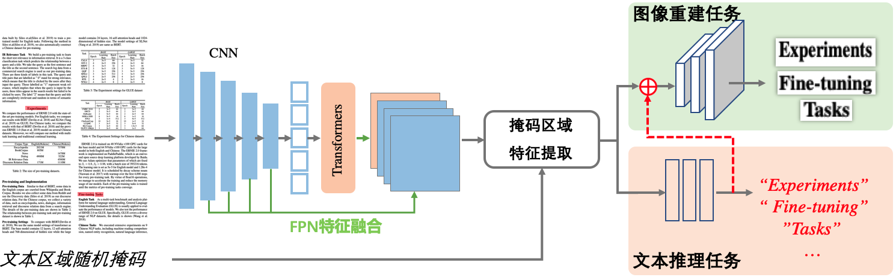

[English](README.md) | 简体中文
## _StrucTexT 2.0_: 文档图像理解基础模型

* [模型简介](#模型简介)
* [预训练任务](#预训练任务)
* [应用任务](#应用任务)
* [公开基准效果](#公开基准效果)
* [快速体验](#快速体验)
* [典型应用场景](#典型应用场景)
* [引用](#引用)

## 模型简介
StrucTexT 2.0 首次创新性地提出 ***单模态图像输入、多模态知识学习*** 预训练框架，仅通过单一文档图像的输入，就能让模型充分捕获语义和结构信息。经过大规模文档图像数据充分学习后的预训练模型，显著提高文档理解全景应用任务效果，囊括文档图像分类、文档版式分析、表格结构解析、文档 OCR、端到端信息抽取等，是首个 OCR 全任务基础预训练模型。StrucTexT 2.0 同时解决了训练数据匮乏和传统 OCR + NLP 链路过长导致的模型表达能力不足、优化效率偏低等问题，能够广泛应用于各行各业行文档、卡证、票据等图像文字识别和信息理解。


<p align="center"> StrucTexT 2.0预训练框架 </p>

关于模型结构的基本设计概念, 请查阅文章:
>[_**StrucTexTv2: Masked Visual-Textual Prediction for Document Image Pre-training**_](https://arxiv.org/pdf/2303.00289.pdf)
>
>Yuechen Yu\*, Yulin Li\*, Chengquan Zhang<sup>*\+</sup>, Xiaoqiang Zhang, Zengyuan Guo, Xiameng Qin, Kun Yao, Junyu Han, Errui Ding, Jingdong Wang (\*: equal contribution, <sup>\+</sup>: corresponding author)
>
>论文已被ICLR 2023会议接收
>

## 预训练任务
StrucTexT 2.0 预训练环节采用的是 CV&NLP 前沿的 Mask-Predict 机制。预训练流程包括四个环节：  
1）基于1100万张公开英文文档数据 [IIT-CDIP Test Collection 1.0](https://data.nist.gov/od/id/mds2-2531) 以及从互联网抓取超1亿张中文图像作为预训练数据集，采用百度高精 OCR 服务进行文字检测和识别，保留高置信度文字内容（包括文字位置信息和文本识别内容）；  
2）将文档图像进行随机文本区域掩码，并输入给编码器（如CNN 和 Transformer 结合结构）进行特征高效编码；  
3）利用文字位置信息对遮盖的文本区域特征进行提取，得到每个文本区域的表征信息；   
4）最后将表征信息分别输入给两个任务分支图像重建和文本推理，通过大数据的加持能够让编码器充分学习多模态知识。

* **掩码图像重建**：采用图像生成模型设计方式，还原被掩码的文本区域图像。
* **掩码文本预测**：利用文本区域表征信息直接做判决，推理出被掩码的文本内容。

## 应用任务
经过大数据预训练产出的 StrucTexT 2.0 模型，可以作为下游应用任务的基础模型，加持不同任务分支网络和对应训练数据即可高效调优，常见的文档理解应用任务包括文档图像分类、文档版式分析、表格结构解析、文档 OCR 和端到端信息抽取等，具体任务描述如下：

* **文档图像分类**：根据文档数据的行业属性一般可以将文档图像归类为合同、简历、表单、卡证、票据等；
* **文档版式分析**：根据文档数据的内容和空间布局信息，可以将文档图像按照不同属性的进行空间划分包括标题、段落、图、列表、表格等；
* **表格结构解析**：需要完成对表格数据进行单元格排列信息的解析；
* **文档 OCR**：对文档图像中出现的文字进行高准确检测和识别；
* **端到端信息抽取**：完整的文档理解服务需要完成用户定义的关键字段文字信息提取，既要完成字段的准确分类，也要完成对应文字内容的识别。

### 数据集
* [RVL-CDIP](https://docs.google.com/u/0/uc?export=download&confirm=9NG1&id=0Bz1dfcnrpXM-MUt4cHNzUEFXcmc) 是一个用于图像分类的数据集，它是由扫描的文档图像组成，共分为16类，如信函、表单、电子邮件、简历、备忘录等。该数据集图像分为32万张训练集、4万个验证集和4万个测试集，并且它的图像的特点是低质量、噪声和低分辨率。
* [PubLayNet](https://github.com/ibm-aur-nlp/PubLayNet) 是一个用于文档图像版面分析的大型数据集，其布局用多边形边框分割标注，它包含超过36万个文档图像，其中对典型的文档布局元素进行了注释，包括文本、标题、列表、表格和图形。
*  [PubTabNet](https://github.com/ibm-aur-nlp/PubTabNet) 是一个用于图像表格识别的大型数据集，包含56.8万以上的表格图像，以及基于HTML表示的标注。
* [FUNSD](https://guillaumejaume.github.io/FUNSD) 是一个用于表单理解的数据集，它包含199张真实的、完全标注的扫描版图片，类型包括市场报告、广告以及学术报告等，并分为149张训练集以及50张测试集。
* [XFUND](https://github.com/doc-analysis/XFUND) 是一个多语种（中文、日语、西班牙语、法语、意大利语、德语、葡萄牙语）的基于人工标注的表单理解数据集。我们在中文子集XFUND-ZH上测试模型的基准效果。

## 公开基准效果

| 任务类型 |  测试集合 | 评价方式 | V2.0 |
|  ----  | ---- | ----  | :----: |
| 文档图像分类   | RVL-CDIP |  Accuray | 93.4 |
| 文档版式分析   | PubLayNet  |   F1-score  |  95.4 |
| 表格结构解析   | PubTabNet  | TEDs | 97.1 |
| 文档 OCR     | FUNSD  | 1-NED | 84.1 |
| 端到端信息抽取 | FUNSD | 1-NED |  55.0 |
| 中文信息抽取 | XFUND-ZH | 1-NED |  67.5 |

## 快速体验
### 安装Paddle环境
本代码库基于PaddlePaddle 2.2.0+，你可参阅[PaddlePaddle-Quick](https://www.paddlepaddle.org.cn/install/quick)进行环境准备，或者使用pip进行安装：

`pip3 install paddlepaddle-gpu --upgrade -i https://mirror.baidu.com/pypi/simple`

#### 环境要求 
* python 3.6+
* cuda >= 10.1
* cudnn >= 7.6
* gcc >= 8.2

#### 安装要求
StrucTexT的依赖库已在requirements.txt中列出，你可以使用以下命令行进行依赖库安装：

`pip3 install --upgrade -r requirements.txt -i https://mirror.baidu.com/pypi/simple`

### 下载推理模型

| 下游模型 | 模型参数(M) | 下载链接 | 
| :---- | :---- | :---- |
| MLP Classification| 28.4 | [StrucTexT\_v2 Base for Document Classify](https://aistudio.baidu.com/aistudio/datasetdetail/147611) |
| Cascade RCNN Detection | 50.2 | [StrucTexT\_v2 Base for Layout Analysis](https://aistudio.baidu.com/aistudio/datasetdetail/147611) |
| Transformer Decoder | 128.5 | [StrucTexT\_v2 Base for Table Structext Recognition](https://aistudio.baidu.com/aistudio/datasetdetail/147611) |
| DB Detection + Attention-OCR | 37.3 | [StrucTexT\_v2 Base for End2End OCR](https://aistudio.baidu.com/aistudio/datasetdetail/147611) |
| DB Detection + Attention-OCR + Labeling | 41.3 | [StrucTexT\_v2 Base for End2End Information Extraction](https://aistudio.baidu.com/aistudio/datasetdetail/147611) |
| DB Detection + Labeling | 27.4 | [StrucTexT\_v2 Base for End2End Information Extraction(XFUND-ZH)](https://aistudio.baidu.com/aistudio/datasetdetail/147611) |

### 使用预训练模型推理
   * RVL-CDIP文档图像分类

```python
# 1. 下载并解压RVL-CDIP数据集到 `./data/`
# 2. 下载模型：StrucTexT_v2_document_classify_base.pdparams
# 3. 运行下述脚本启动图像分类任务评测
python -u ./tools/eval.py \
    --config_file=configs/document_classify/classify_rvlcdip_base.json \
    --task_type=document_classify \
    --label_path=./data/rvl-cdip/test.txt \
    --image_path=./data/rvl-cdip/images \
    --weights_path=StrucTexT_v2_document_classify_base.pdparams
```
   * PubLayNet版式分析检测

```python
# 1. 进入目录：`./src/tasks/layout_analysis/`
# 2. 下载并解压PubLayNet数据集到 `./data/`
# 3. 下载模型：StrucTexT_v2_layout_analysis_base.pdparams
# 4. 运行下述脚本启动版式分析检测任务评测
sh set_env.sh
python -u ./tools/eval.py \
	-c configs/layout_analysis/cascade_rcnn/cascade_rcnn_v2.yml \
	-o weights=StrucTexT_v2_layout_analysis_base.pdparams
```
   * PubTabNet表格结构解析

```python
# 1. 下载并解压PubTabNet数据集到 `./data/`
# 2. 下载模型：StrucTexT_v2_table_recognition_base.pdparams
# 3. 运行下述脚本启动表格结构解析任务评测
python -u tools/eval.py \
    --config_file=configs/table_recognition/recg_pubtabnet_base.json \
    --task_type=table_recognition \
    --label_path=./data/pubtabnet/PubTabNet_2.0.0_val.jsonl \
    --image_path=./data/pubtabnet/val/ \
    --weights_path=StrucTexT_v2_table_recognition_base.pdparams
```
   * FUNSD数据集端到端OCR

```python
# 1. 下载并解压FUNSD数据集到 `./data/`
# 2. 下载模型：StrucTexT_v2_end2end_ocr_base.pdparams
# 3. 运行下述脚本启动端到端OCR任务评测
python -u ./tools/eval.py \
    --config_file=configs/end2end_ocr/ocr_funsd_base.json \
    --task_type=end2end_ocr \
    --label_path=./data/funsd/testing_data/annotation \
    --image_path=./data/funsd/testing_data/image \
    --weights_path=StrucTexT_v2_end2end_ocr_base.pdparams
```
   * FUNSD数据集端到端信息抽取

```python
# 1. 下载并解压FUNSD数据集到 `./data/`
# 2. 下载模型：StrucTexT_v2_end2end_ie_base.pdparams
# 3. 运行下述脚本启动端到端信息抽取任务评测
python -u ./tools/eval.py \
    --config_file=configs/end2end_ie/ocr_funsd_base.json \
    --task_type=end2end_ie \
    --label_path=./data/funsd/testing_data/annotation \
    --image_path=./data/funsd/testing_data/image \
    --weights_path=StrucTexT_v2_end2end_ie_base.pdparams
```
   * XFUND-ZH数据集中文信息抽取
      * 由于中文识别任务需要较多的数据，XFUND-ZH标注量较少无法支撑识别分支的有效训练，因此我们在中文任务上微调了字段检测和分类两个分支，识别分支直接采用PaddleOCR提供的[识别模型](https://github.com/PaddlePaddle/PaddleOCR/blob/release/2.5/applications/%E5%A4%9A%E6%A8%A1%E6%80%81%E8%A1%A8%E5%8D%95%E8%AF%86%E5%88%AB.md)，并提供最终用于评测的数据和脚本。

```python
# 1. 运行下述脚本启动字段检测和分类推理
python tools/infer_xfund.py

# 2. 调用PaddleOCR提供的识别模型进行字段识别
# 3. 运行下述脚本启动端到端信息抽取任务评测
python tools/eval_xfund.py \
    --pred_folder=data/xfund/res/ \
    --gt_file=data/xfund/xfun_normalize_val.json
```


## 典型应用场景
1. 泛卡证票据信息抽取应用，可广泛适用于身份认证、金融开户、征信评估、商户入驻等业务场景，性能相较 StrucTexT 1.0 提升 **30%** 以上。
2. 政务办公文档还原应用，对办公场景的各类文档进行结构化识别，如企业年报、论文、行业报告等，方便对文档类图片进行结构化分析，版式分析和表格结构化解析等能力最大错误率下降达 **50%**。


StrucTexT 2.0 近期也将陆续升级百度AI开放平台相关 [OCR 产品矩阵](https://ai.baidu.com/tech/ocr)，以及百度零门槛 AI 开放平台产品 [EasyDL-OCR](https://ai.baidu.com/easydl/ocr)，敬请期待。

## 引用
相关文献请引用:
```
@inproceedings{yu2023structextv,
    title={StrucTexTv2: Masked Visual-Textual Prediction for Document Image Pre-training},
    author={Yuechen Yu and Yulin Li and Chengquan Zhang and Xiaoqiang Zhang and Zengyuan Guo and Xiameng Qin and Kun Yao and Junyu Han and Errui Ding and Jingdong Wang},
    booktitle={The Eleventh International Conference on Learning Representations },
year={2023},
    url={https://openreview.net/forum?id=HE_75XY5Ljh}
}
```

