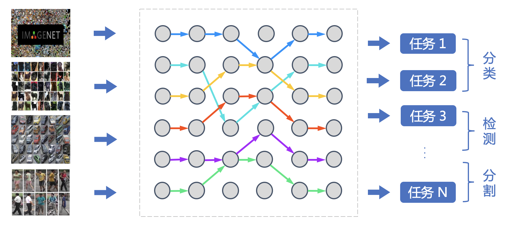
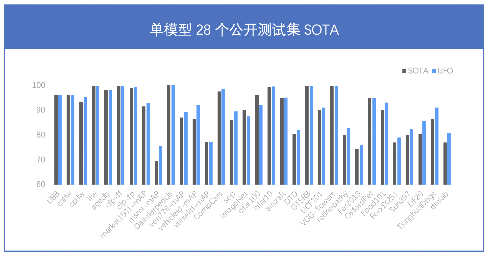
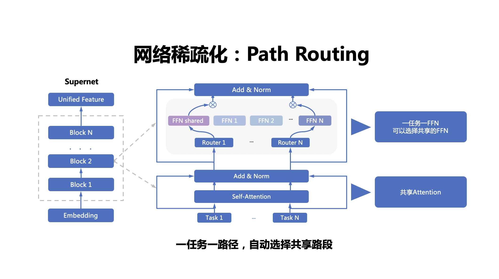
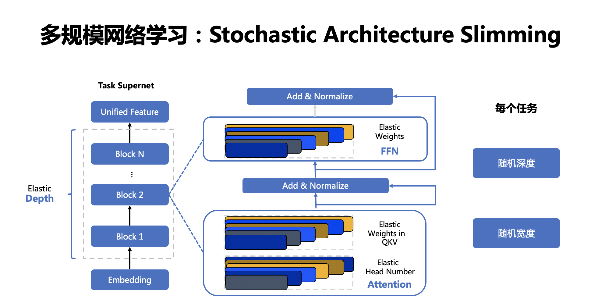
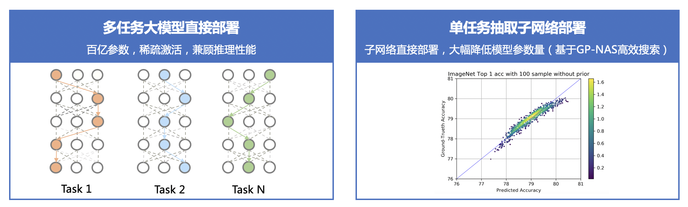

English | [简体中文](README_ch.md)

# VIMER-UFO 2.0 (CV Foundation Model)

- [Introduction](#Introduction)
- [Methodology](#Methodology)
  * [All In One:A more powerful and general vision foundation model](#AllInOne)
  * [One For All:Flexible and scalable elastic deployment solution](#OneForAll)
  * [Super network design and training scheme](#Supernetwork)
  * [One For All Tasks](#OneForAllTasks)
  * [One For All Chips](#OneForAllChips)
- [Results](#Results)
  * [17 billion parameters, the largest CV model in the industry, 28 public datasets SOTA for a single model](#170B-Prams-28SOTA)
- [Application Scenarios and Solutions](#Application-Scenarios)
  * [Direct deployment](#Direct-deployment)
  * [Sub-network extraction](#Sub-network-extraction)
  * [Fast expansion to new tasks](#Fast-expansion-to-new-tasks)
  * [Downstream tasks distillation](#Downstream-tasks-distillation)
- [Instructions](#Instructions)
- [Download the 17B pretrained model](#Download-17B-pretrained-model)

## Introduction
 
In recent years, pre-trained large models have refreshed records again and again, showing amazing results, but for the industry, it is inevitable to face the problem of how to apply them. The implementation process of the current pre-training model can be summarized as: for a specific task with only a small amount of labeled data, use the task data to fine-tune the pre-training model and > deploy it online. However, when the number of pre-trained model parameters continues to increase, the process faces two serious challenges. First, with the sharp increase in the number of model parameters, the computing resources required for fine-tuning of large models will become very huge, and ordinary developers usually cannot afford it. Secondly, with the development of AIoT, more and more AI applications are migrated from the cloud to edge devices and end devices, but large models cannot be directly deployed on these hardware with extremely limited storage and computing power.

In response to the problems faced by pre-training large models, Baidu proposed a unified feature representation optimization technology (UFO: Unified Feature Optimization). The main contents of the VIMER-UFO 2.0 includes:
  * All in One:17 billion parameters, the largest CV model in the industry, covering 20+ CV basic tasks such as face, human body, vehicle, commodity, food fine-grained classification, and 28 public test set effects for a single model SOTA.
  * One for All：The first supernetwork and training scheme for visual multitasking, supports flexible deployment of various tasks and various hardware, and solves the problem of large model parameters and poor inference performance.

## Methodology

### AllInOne

The previous mainstream visual model production process usually adopts a single-task "train from scratch" scheme. Each task is trained from scratch, and each task cannot learn from each other. Due to the bias problem caused by insufficient single-task data, the actual effect depends too much on the distribution of task data, and the scene generalization effect is often not good. The booming big data pre-training technology in the past two years has learned more general knowledge by using a large amount of data, and then transferred it to the downstream tasks. In essence, different tasks learn from each other's knowledge. The pre-training model obtained based on massive data has good knowledge completeness, and it is suitable for downstream tasks.
Based on a small amount of data, fine-tuning can still achieve better results. However, the model production process based on pre-training + downstream task fine-tuning requires separate training of models for each task, which consumes a large amount of R&D resources.

The VIMER-UFO All in One multi-task training scheme proposed by Baidu can be directly applied to handle multiple tasks by training a powerful general model with data from multiple tasks. It not only improves the performance of a single task through cross-task information, but also eliminates the fine-tuning process of downstream tasks. The VIMER-UFO All in One R&D model can be widely used in various multi-task AI systems. Taking smart city scenarios as an example, VIMER-UFO can use a single model to achieve SOTA effects for multiple tasks such as face recognition, human body and vehicle ReID. , and the multi-task model can achieve significantly better results than the single-task model, which proves the effectiveness of the information borrowing mechanism between multi-tasks.

In response to the development and deployment of large models, UFO provides a One for All solution. By introducing the concept of a super network, a super network is composed of many sparse subnetworks. Each subnet is a path in the super network. The model training process of parameter quantity, different task functions and different precisions becomes training one.
A hypernetwork model. The trained One for All UFO super network large model can generate corresponding plug-and-play small models for different tasks and equipment at low cost, realizing the ability of One for All Tasks and One for All Chips

### OneForAll

Due to the limitation of computing power and storage, large models cannot be directly deployed on edge devices. When a model developed for a cloud device is to be deployed to an edge device or end device, model compression or complete redesign is often required, and the compression of a large pre-trained model itself requires a lot of resources.

In addition, different tasks have different functions and performance requirements of the model. For example, the face recognition access control system only needs to have the face recognition function, and the management and control system of the smart community needs to have the ability of face recognition and human body analysis at the same time. In some scenarios It also needs to have both model recognition and license plate recognition capabilities. even the same
For face recognition tasks, access control systems and financial payment systems also have different requirements for model accuracy and performance. Currently, multiple single-task models need to be customized and developed for these tasks. In addition, it is necessary to adapt to different hardware platforms. The workload of AI model development has increased significantly.

For the development and deployment of large models, VIMER-UFO provides a One for All solution. By introducing the concept of a super network, a super network is composed of many sparse subnetworks. Each subnet is a path in the super network. Change the model training process of different parameter amounts, different task functions and different accuracies into training a super network model. The trained VIMER-UFO One for All super network large model can generate corresponding plug-and-play small models for different tasks and equipment at low cost, and realize the ability of One for All Tasks and One for All Chips.

### Supernetwork 

VIMER-UFO 2.0 designs a multi-task multi-path super-network based on the Vision Transformer structure. Unlike Switch Transformer, which selects paths with pictures as granularity, VIMER-UFO 2.0 selects paths with task as granularity, so that when the super network is trained, it can be independently selected according to different tasks.

Extract the corresponding sub-network for deployment instead of deploying the entire large model. In addition to selecting different FFN units for different paths in the supernet of VIMER-UFO 2.0, the Attention module and the FFN module also support elastic scaling to realize the expansion of the search space of the network and provide more optional subnets for hardware deployment.
network and improve accuracy.

The VIMER-UFO 2.0 supernet is divided into a multipath FFN supernet and a scalable Attention supernet. First of all, for the multi-path FFN supernet module, each task has two different path options, that is to choose shared FFN (FFN-shared) or exclusive FFN (FFN-taskX). The scale of parameters in FFN is flexibly selected according to the scaling factor; therefore, there are (T * ratio)^L different FFN paths in the FFN supernetwork, where T is the number of tasks, L is the number of layers in the network, and ratio is the scaling factor quantity. For the self-attention supernet, each sub-network can choose
Choose different Head quantity QKV matrix parameter quantity.

During VIMER-UFO 2.0 training, the model is divided into two levels: task supernet and chip supernet according to the hierarchical structure. And use different training schemes for optimization.

### OneForAllTasks

During task specific supernetwork training, both network parameters (FFN) and routing parameters (Router) need to be optimized at the same time. As mentioned earlier, the network parameters include shared FFN (FFN-shared) and dedicated FFN (FFN-taskX). All tasks will update the shared FFN parameters, and specific tasks will only update the dedicated FFN parameters. 

Because the routing parameters are discrete and non-steerable, they are optimized by Gumbel Softmax during training. Since multiple tasks are optimized at the same time in the process of training the supernet, and a routing mechanism is introduced at the same time, more parameters can be shared among related tasks, and the interference between unrelated tasks can be minimized, so as to achieve the goal of different tasks.

The optimal sub-network model for the same task. In business applications, it is only necessary to extract the corresponding task subnets according to the effects of different subnetworks on specific tasks, and then deploy them directly without repeated training.

### OneForAllChips

After the task supernet training is completed, the chip specific supernet is trained for the sub-network extracted from each task. After the above training, the chip specific supernet for each task is obtained. In business applications, sub-networks of different depths and widths can be extracted for deployment according to the different storage capacities and computing power of different platforms, parameters and computational complexity of the step-by-step compression model. Due to the large amount of number of the sub-networks in the super network, it is not realistic to test the accuracy and delay of each sub-network one by one. Therefore, in VIMER-UFO 2.0, the Gaussian process-based hyperparameter hyperparameter estimation technology in GP-NAS is used. It is necessary to sample less sub-networks in the super-network for evaluation, and the accuracy and speed of other networks can be accurately predicted.

## Results

### 170B-Prams-28SOTA

VIMER-UFO 2.0 has a set of parameters for a single model, and achieved SOTA results on 28 mainstream CV public datasets without downstream finetuning. At the same time, although the number of parameters of the VIMER-UFO 2.0 large model has reached 17 billion, thanks to the sparse structure of Task-MoE, only some parameters need to be activated during inference of each task, the calculation amount is equivalent to the scale of the 600 million parameter model, and the speedup ratio is close to 30 times.

|Tasks|General|Airplane|Pattern recognition|German traffic signs|Font Recognition|action|flower|medical image|medical image|facial expression|Pet|food|food|scene|mushroom|Canine|Distance|
|:----:|:----:|:----:|:------:|:------------:|:------:|:----:|:---:|:------:|:------:|:----------:|:----:|:----:|:----:|:------:|-------:|:------:|:------:|
|Datasets|ImageNet|aircraft|DTD |GTSRB |Omni|UCF101|VGG-flowers|PatchCamelyon|retinopathy|Fer2013|OxfordPet|Food101|FoodX251|Sun397|DF20|TsinghuaDogs| dmlab |
| SOTA |90.04 | 94.9 |  80.5  |     99.71    |  99.63 | 90.21|99.76|  97.5  |  80.1  |    74.42   | 94.9 | 90.3 | 77.1 |   80   |  80.45 |  86.4  |   77   |
| UFO  |87.45 | 95.05|  81.6  |     99.89    |  84.47 | 91.23|99.76|  90.91 |  82.61 |    76.13   | 96.13| 93.57| 78.97|   82.45|  81.9  |  91.03 |   80.93|

| Tasks |Face |Face | Face  |    Face     | Face   | Face | Face|  Person  | Person  |    Pedestrian    | Vehicle | Vehicle | Vehicle | Vehicle  | Products   |CIFAR10|CIFAR100|
|:----:|:----:|:----:|:------:|:------------:|:------:|:----:|:---:|:------:|:------:|:----------:|:----:|:----:|:----:|:------:|-------:|:------:|:------:|
|Datasets|IJBB|calfw|cplfw|lfw|agedb|cfp-ff|cfp-fp|market1501-mAP|msmt-mAP|Daimlerpedcls|veri776-mAP|vehicleid-mAP|veriwild-mAP|CompCars|sop|cifar10|cifar100|
| SOTA |96.03 | 96.2 |  93.37 |     99.85    |  98.35 | 99.89|98.99|  91.5  |  69.4  |    99.98   | 87.1 | 86.4 | 77.3 |   97.6 |  85.9  |  99.4  |  96.08 |
| UFO  |96.03 | 96.2 |  95.22 |     99.85    |  98.26 |  99.9|99.33|  93.2  |  75.08 |    100     | 89.21| 91.35| 77.45|   98.36|  88.96 |  99.4  |  92.04 |

## Application-Scenarios

The VIMER-UFO 2.0 foundation model can be widely used in various multi-task AI systems such as smart cities, unmanned driving, and industrial production. At the same time, VIMER-UFO 2.0 supports a variety of application modes, taking into account both efficiency and effect.

### Direct-deployment

For AI systems with multi-task processing requirements, the VIMER-UFO 2.0 large model has the ability to process multiple tasks, such as simultaneous detection and recognition of targets such as faces, human bodies, and vehicles. At the same time, thanks to the Task-MoE sparse structure used by the VIMER-UFO 2.0 model, at runtime, according to different tasks, the optimal region for activation is automatically selected, and each task only activates part of the parameters of the model, which significantly reduces the amount of computation, and the inference efficiency is close to the mainstream single-task small model. This is similar to the brain of the human face. After millions of years of evolution, the human brain has formed a structure of partitions. Different regions are responsible for specific functions and at the same time interact with each other.
collaboration as a whole.

### Sub-network-extraction

For AI services that only require a single or individual processing power, some parameters can be directly extracted from the VIMER-UFO 2.0 large model according to the task requirements, and a model for a specific task can be deployed, which can greatly reduce the number of parameters of the model, such as VIMER-UFO The 2.0 large model has a scale of 17 billion parameters, while the single-task model extracted > contains only 600 million parameters. The amount of chip-level model parameters extracted based on the single-task model can be further reduced to 100 million, with a compression ratio of 100+ times. And different tasks can be freely combined, which greatly improves the development and deployment efficiency of AI services.

### Fast-expansion-to-new-tasks

For new tasks that are not supported by the VIMER-UFO 2.0 model, VIMER-UFO 2.0 supports fewshot finetuning in the case of updating only part parameters to achieve fast task expansion. According to the previous principle part, there is a share branch (Attention and FFN-Shared) in the super network of VIMER-UFO 2.0. This branch uses all the task data to optimize the training process of the VIMER-UFO 2.0 large model, so it has Powerful task generalization, for new tasks that are not supported, only need to extract the parameters of the branch and use a small amount of data for fine-tuning to achieve > excellent performance on new tasks. At the same time, because only some parameters need to be updated, the cost of downstream finetune is greatly reduced, which solves the current problem of mainstream large model landing applications.

Fast expansion results：

|    Datasets          |         SOTA           |        10% Finetune |    100% Finetune    |
|:---------------------|:----------------------:|:-------------------:|:-------------------:|
|      dmlab           |          77            |         74.8        |        80.93        |
|      retinopathy     |          80.1          |         60.9        |        82.90        |
|      aircraft        |          94.90         |         70.84       |        95.02        |
|      cifar10         |          99.40         |         99.32       |        99.40        |
|      gtsrb           |          99.7          |         99.83       |        99.90        |
|      Cityscape       |          84.3          |         -           |        84.36        |
|      PASCAL VOC      |          89.3          |         -           |        89.14        |

### Downstream-tasks-distillation

In order to better support deployment on mobile and edge devices, VIMER-UFO 2.0 also supports the extraction of sub-network models for model distillation. Combined with the heterogeneous distillation technology developed by Baidu, the knowledge in the Transformer structure is transferred to CNN. The model parameters The prarms is further compressed from the 100 million level to the million level scale,
1000+ times compression overall.

|    Datasets       |SOTA with Student's Params |    Teacher Params   |    Teacher Acc      | Student backbone | Student Params | Student Acc|
|:---------------------|:----------------------:|:-------------------:|:-------------------:|:----------------:|:--------------:|:----------:|
|      CALFW           |          96.2          |         600M          |        96.2         |     ResNet50     |      25M       |    96.1    |
|      CALFW           |          95.15         |         600M          |        96.2         |     MobileNetV3  |      5M        |    95.38   |
|      CPLFW           |          93.37         |         600M          |        95.22        |     ResNet50     |      25M       |    93.77   |
|      CPLFW           |          88.55         |         600M          |        95.22        |     MobileNetV3  |      5M        |    91.63   |
|      LFW             |          99.85         |         600M          |        99.85        |     ResNet50     |      25M       |    99.85   |
|      LFW             |          99.85         |         600M          |        99.85        |     MobileNetV3  |      5M        |    99.67   |
|      CFP-FF          |          99.89         |         600M          |        99.89        |     ResNet50     |      25M       |    99.86   |
|      CFP-FF          |          -             |         600M          |        99.89        |     MobileNetV3  |      5M        |    99.46   |
|      CFP-FP          |          98.99         |         600M          |        99.3         |     ResNet50     |      25M       |    99.04   |
|      CFP-FP          |          98.5          |         600M          |        99.3         |     MobileNetV3  |      5M        |    96.49   |
|      ImageNet        |  74.5 (Deit-Tiny with distillation) |         600M          |        87.45        |     ViT-Tiny     |      5M        |    74.74   |

## Instructions

1. Models, training codes and evaluation scripts related to VIMER-UFO 2.0 have been open sourced. More details, visit: https://github.com/PaddlePaddle/VIMER/tree/main/UFO/OneForAll
2. VIMER-UFO 2.0 will also be opened on Baidu's zero-threshold AI development platform EasyDL in the near future.

### Download-17B-pretrained-model

Please send your request to vimer-ufo@baidu.com . The request may include your name and orgnization. We will notify you by email as soon as possible.

If you have any question, please contact xiteng01@baidu.com
