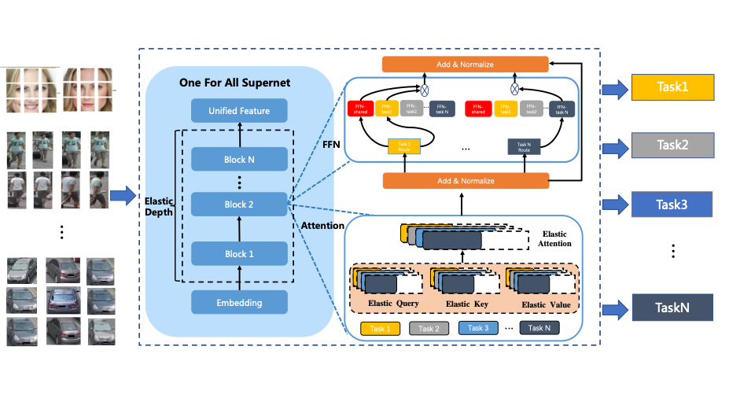
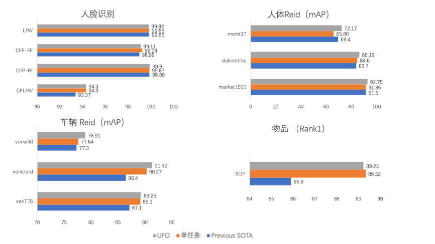
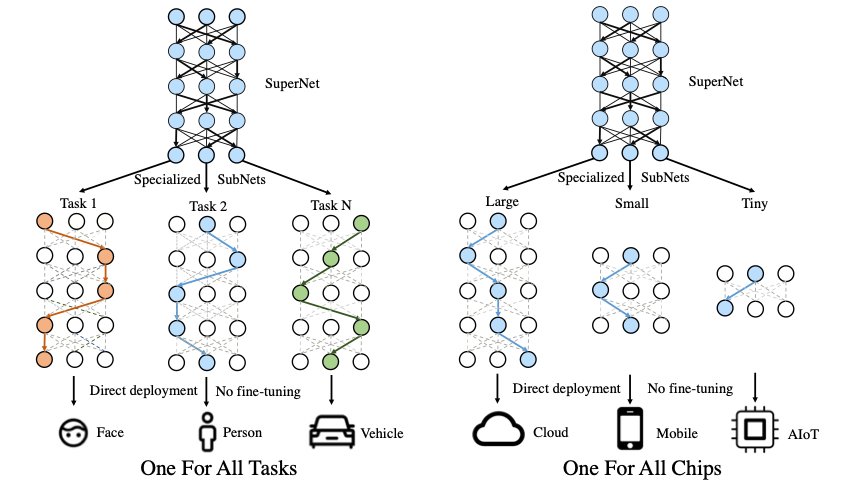
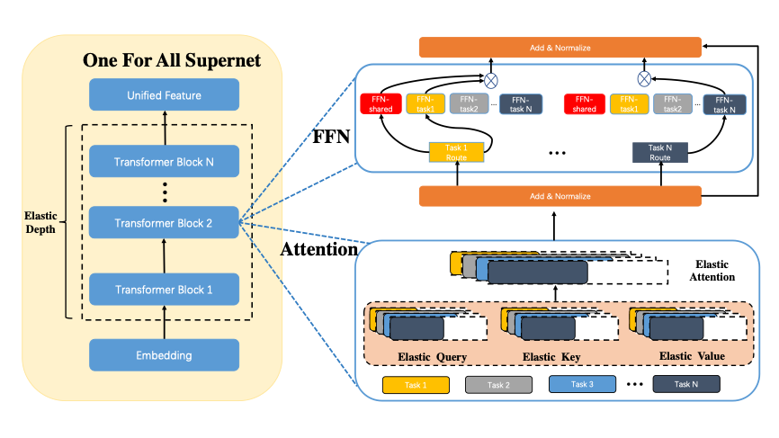
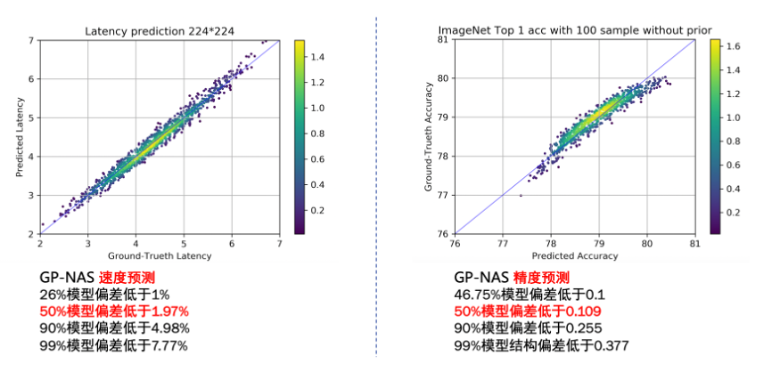
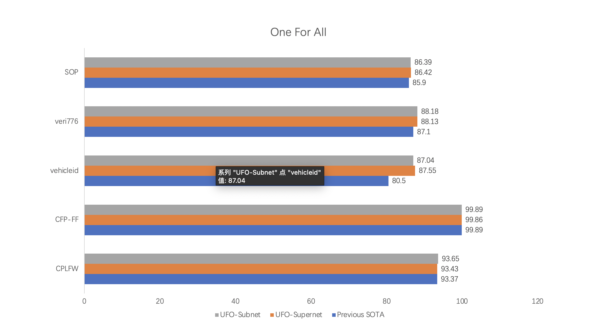

# UFO

- [ALL in one](#AllinOne:)
  * [UFO整体架构](#UFO整体架构)
  * [单模型覆盖智慧城市4大任务](#单模型覆盖智慧城市4大任务)
  * [任务设置与数据](#任务设置与数据)
  * [统一各任务配置](#统一各任务的配置)
  * [多任务异构数据采样策略和DropPath正则技术](#多任务异构数据采样策略和DropPath正则技术)
  * [单模型刷新10项公开数据集SOTA结果](#单模型刷新10项公开数据集SOTA结果)
- [One for All](#OneforAll:)
  * [OneforAll架构](#OneForAll架构图1)
  * [超网络设计与训练方案](#超网络设计与训练方案)
  * [OneforAll架构](#OneForAll架构图2)
  * [OneForAllTasks](#OneForAllTasks)
  * [OneForAllChips](#OneForAllChips)
  * [基于高斯过程的模型精度速度预测器](#基于高斯过程的模型精度速度预测器)
  * [单超网络支撑智慧城市多任务灵活部署](#单超网络支撑智慧城市多任务灵活部署)
  * [基于超网络的智慧城市灵活部署方案](#基于超网络的智慧城市灵活部署方案)

百度提出统一特征表示优化技术（UFO：Unified Feature Optimization），在充分利用大数据和大模型的同时，兼顾大模型落地成本及部署效率。UFO技术方案的主要内容包括：
  * All in one：设计视觉表示多任务协同训练方案，免去了下游任务fine-tuning的过程，实现单模型在智慧城市多个核心任务效果全面领先
  * One for all：首创针对视觉多任务的超网络与训练方案，支持各类任务、各类硬件的灵活部署，解决大模型推理性能差的问题。

### UFO整体架构

## AllinOne: 功能更强大、更通用的视觉模型	

之前主流的视觉模型生产流程，通常采用单任务 “train from scratch”方案。每个任务都从零开始训练，各个任务之间也无法相互借鉴。由于单任务数据不足带来偏置问题，实际效果过分依赖任务数据分布，场景泛化效果往往不佳。近两年蓬勃发展的大数据预训练技术，通过使用大量数据学到更多的通用知识，然后迁移到下游任务当中，本质上是不同任务之间相互借鉴了各自学到的知识。基于海量数据获得的预训练模型具有较好的知识完备性，在下游任务中基于少量数据fine-tuning依然可以获得较好的效果。不过基于预训练+下游任务fine-tuning的模型生产流程，需要针对各个任务分别训练模型，存在较大的研发资源消耗。

百度提出的UFO All in One模型，通过使用多个任务的数据训练一个功能强大的通用模型，可被直接应用于处理多个任务。不仅通过跨任务的信息提升了单个任务的效果，并且免去了下游任务fine-tuning过程。UFO All in One模型研发模式可被广泛应用于各类多任务AI系统，以智慧城市的多任务大模型为例，UFO All in One可以用单模型实现多个任务的SOTA识别效果，同时多任务模型可获得显著优于单任务模型的效果，证明了多任务之间信息借鉴机制的有效性。

### 单模型覆盖智慧城市4大任务

智慧城市是目前计算机视觉技术最重要的应用场景之一，在智慧城市的各个任务中，往往要同时处理人脸、人体、车辆和通用物体等目标，这对AI系统的多任务协同能力提出了非常高的要求。现有的视觉模型大多只能检测或识别其中的一类目标，百度通过UFO方案中的多任务协同学习技术，产出城市视觉UFO模型同时处理这4类任务，并在10项公开数据集上效果取得SOTA。下面详细介绍UFO的多任务协同训练方案。

### 任务设置与数据

为验证方案的有效性且便于公平对比，使用10项公开数据集进行训练和测试。各个数据集的统计信息如表所示：

### 训练集

| **任务**                      | **数据集**                     | **图片数**                     | **类别数**                     |
| :-----------------------------| :----------------------------: | :----------------------------: | :----------------------------: |
| 人脸                          |           MS1M-V3              |           5,179,510            |           93,431               |
| 人体                          |           Market1501-Train     |           12,936               |           751                  |
| 人体                          |           DukeMTMC-Train       |           16,522               |           702                  |
| 人体                          |           MSMT17-Train         |           30,248               |           1,041                |
| 车辆                          |           Veri-776-Train       |           37,778               |           576                  |
| 车辆                          |           VehicleID-Train      |           113,346              |           13,164               |
| 车辆                          |           VeriWild-Train       |           277,797              |           30,671               |
| 商品                          |           SOP-Train            |           59,551               |           11,318               |

### 测试集

| **任务**                      | **数据集**                     | **图片数**                     | **类别数**                     |
| :-----------------------------| :----------------------------: | :----------------------------: | :----------------------------: |
| 人脸                          |           LFW                  |           12,000               |           -                    |
| 人脸                          |           CPLFW                |           12,000               |           -                    |
| 人脸                          |           CFP-FF               |           14,000               |           -                    |
| 人脸                          |           CFP-FP               |           14,000               |           -                    |
| 人脸                          |           CALFW                |           12,000               |           -                    |
| 人脸                          |           AGEDB-30             |           12,000               |           -                    |
| 人体                          |           Market1501-Test      |           19,281               |           750                  |
| 人体                          |           DukeMTMC-Test        |           19,889               |           702                  |
| 人体                          |           MSMT17-Test          |           93,820               |           3,060                |
| 车辆                          |           Veri-776-Test        |           13,257               |           200                  |
| 车辆                          |           VehicleID-Test       |           19,777               |           2,400                |
| 车辆                          |           VeriWild-Test        |           138,517              |           10,000               |
| 商品                          |           SOP-Test             |           60,502               |           11,316               |

### 统一各任务的配置

从模型优化的层面来说，以往不同任务模型训练的batch size 、学习率乃至于优化器都各不相同。为了方便后续的多任务训练，UFO方案统一了各个任务的模型结构以及优化方法。任务配置如下表所示：

|                               |        **人脸**/ **人体**/**商品**/**车辆**          |
| :-----------------------------| :----------------------------------------------------|
| 输入大小                      |    384 × 384                                         |
| Batch Size                    |    1024/512/512/512                                  |
| 数据增强                      |    Flipping + Random Erasing + AutoAug               |
| 模型结构                      |    ViT-Large                                         |
| 输出特征维度                  |    1024                                              |
| 损失函数                      |    CosFace Loss/(CosFace Loss + Triplet Loss)*3      |
| 优化器                        |    SGD                                               |
| 初始学习率                    |    0.2                                               |
| LR scheduler                  |    Warmup + Cosine LR                                |
| 迭代次数                      |    100,000                                           |

### 多任务异构数据采样策略和DropPath正则技术

多任务学习首先面临的问题是如何构建 Batch。常用的方式有两种，一种是同数据域的 Batch 组成，即 Batch 内的数据均来自同一个任务，通过不同的 Batch 选择不同的任务来保证训练所有任务。另一种是不同数据域的 Batch 组成，即Batch 内的数据来自不同的任务。同数据域的 Batch 组成面临的问题是当模型中使用 Batch Norm 这一常见的操作时，因为训练时的统计值（单任务统计值）和测试时的统计值（多任务统计值）差异较大，导致模型效果较差。如下表所示，通过ResNet50结构在人体 Market1501 和物品SOP两个任务中验证，使用混合数据域方案可以大幅提高两任务的效果。

|    Batch 数据混合    |         Market1501 (rank1/mAP)    |        SOP (rank1)        |
| :--------------------| :--------------------------------:|:-------------------------:|
|  同构                |           73.13 / 50.58           |          79.54            |
|  异构                |           94.27 / 85.77           |          85.76            |

在四个任务中，人体和物品的训练集数量最小，都只有 6 万张图片左右，而人脸和车辆则各有约 500 万和 40  万张图片。因此在多任务训练过程中，呈现出了人体、物品快速过拟合，而人脸和车辆欠拟合的现象。为解决各个任务数据不均衡导致的过拟合问题，通过在训练过程中使用 Drop Path 正则化方法，在人体和物品任务中实现mAP1%~3%的提升，同时其他任务效果持平或更好。

### 单模型刷新10项公开数据集SOTA结果
 
基于多任务协同训练方案得到的城市视觉 All in One UFO模型，和之前的单任务SOTA 结果相比，在 4 个任务的10个测试集上都达到了新的SOTA，同时相比使用同样模型结构的单任务结果，在多数任务上UFO也表现的更好，证明了多任务之间信息借鉴机制的有效性。

### 10项公开数据集SOTA结果

在上图中，灰色表示表示城市视觉 All in One UFO模型的结果，橙色表示和UFO模型使用相同模型结构的单任务结果，蓝色表示之前同样数据集上最优的单任务结果。以上所有结果都不使用预训练数据，同时无重排序策略。

## OneforAll: 灵活、可伸缩的弹性部署方案	

受算力和存储的限制，大模型无法直接部署在边缘设备上。一个针对云端设备开发的模型要部署到边缘设备或端设备时往往要进行模型压缩，或完全重新设计，而预训练大模型的压缩本身需要耗费大量的资源。

另外，不同任务对模型的功能和性能要求也不同，例如人脸识别门禁系统只需具备人脸识别功能即可，智慧社区的管控系统则需要同时具备人脸识别和人体分析的能力，部分场景还需要同时具备车型识别及车牌识别能力。即便是同样的人脸识别任务，门禁系统和金融支付系统对模型的精度和性能要求也不同。目前针对这些任务往往需要定制化开发多个单任务模型，加之需要适配不同的硬件平台，AI模型开发的工作量显著增长。

针对大模型的开发和部署问题，UFO给出了One for All的解决方案，通过引入超网络的概念，超网络由众多稀疏的子网络构成，每个子网络是超网络中的一条路径，将不同参数量、不同任务功能和不同精度的模型训练过程变为训练一个超网络模型。训练完成的One for All UFO超网络大模型即可针对不同的任务和设备低成本生成相应的可即插即用的小模型，实现One for all tasks 和 One for all chips的能力

### OneForAll架构图1

## 超网络设计与训练方案

UFO基于Vision Transformer结构设计了多任务多路径超网络。超网络分为多路径FFN超网和与可伸缩attention超网两部分。与谷歌Switch Transformer不同的是，UFO的超网不同的路径除可选择不同FFN单元，同时Attention模块支持根据不同任务弹性伸缩，实现网络的搜索空间扩展，为硬件部署提供更多可选的子网络，并提升精度。

UFO还专门设计了针对多任务超网络的训练方案。首先针对超网络中的FFN超网模块，每个任务的每个block中会自动学习共享FFN(FFN-shared)和该任务专属FFN(FFN-taskX)的加权系数，所有任务都会更新共享FFN的参数，特定任务只会更新专属的FFN参数。在FFN超网训中，对于每个block, 每个子网络都有三种不同的路径选择，即选择共享FFN，选择专属FFN或者选择加权的FFN。对于所有的FFN，都可以选择不同的放缩系数。因此FFN超网络中共有中共有（T*3*ratio）**L种不同的FFN路径，其中T为task的数量，L为网络的层数, ration为放缩系数的数量。而对于self-attention超网，每个子网络可以选择不同的Head数量以及block的重复次数。

### OneForAll架构图2

### OneForAllTasks

由于在训练超网的过程中使用了各个任务的数据，并对超网施加任务约束，可以让相关的任务共享更多的参数，而不相关的任务之间尽量减少干扰，从而获得针对不同任务最优的子网络模型。在业务应用时，只需要根据不同子网络在特定任务的效果，抽取出对应的子网络结构和参数，即可直接部署，无需重复训练。

### OneForAllChips

针对不同平台存储容量和算力不同，从训练好的UFO超网络模型中选择不同大小和计算量的子网络进行部署。由于超网络中子网络的数据众多，每个子网逐一测试精度和延时并不现实，因此在UFO中，使用了GP-NAS【1】中的基于高斯过程的超参数超参估计技术，只需采样超网络中少了子网络进行评估，即可准确预测出其他网络的精度和速度。

### 基于高斯过程的模型精度速度预测器

### 单超网络支撑智慧城市多任务灵活部署

基于上述方案，使用公开数据训练的One for All UFO超网络模型可以在智慧城市人脸、人体、车辆和物品4类任务的6个公开测试集上精度达到SOTA，同时从UFO超网络中抽取的子网络，在参数量压缩20%~30%的情况下，同样可以超过之前SOTA的结果。

### 基于超网络的智慧城市灵活部署方案

[1] GP-NAS: Gaussian Process based Neural Architecture Search [论文地址](https://openaccess.thecvf.com/content_CVPR_2020/papers/Li_GP-NAS_Gaussian_Process_Based_Neural_Architecture_Search_CVPR_2020_paper.pdf)
