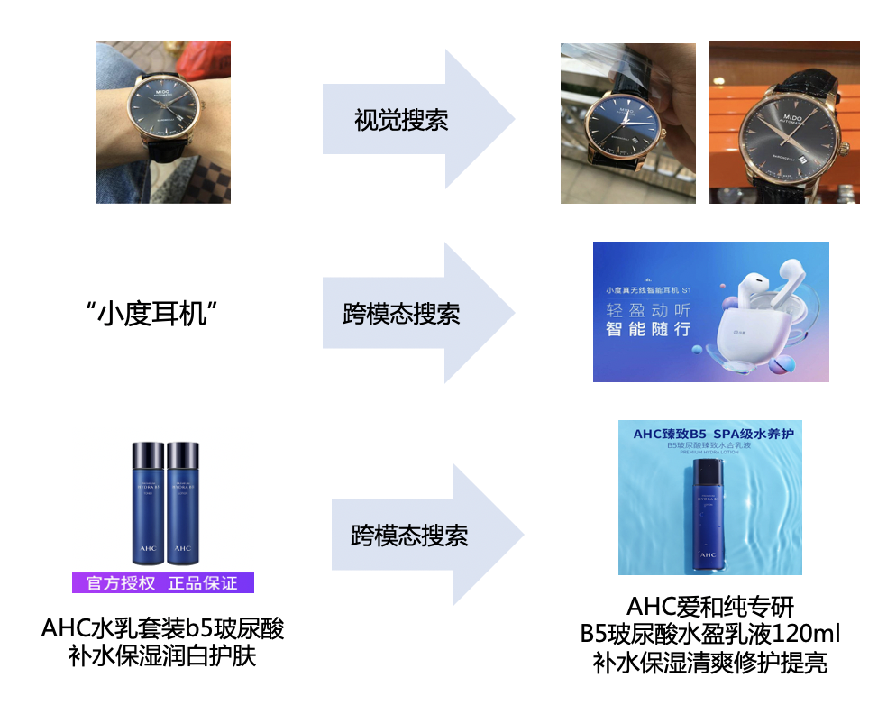

English | [简体中文](README_ch.md)
## _UMS_: Unified Multi-Source Pre-training for Product
- [Model description](#model-description)
- [Principle introduction](#principle-introduction)
- [Unified product visual and image-text representation](#unified-product-visual-and-image-text-representation)
- [Extensive coverage of product search tasks](#extensive-coverage-of-product-search-tasks)
- [Model performance](#model-performance)
  * [Product visual retrieval task](#product-visual-retrieval-task)
  * [Product multi-modal retrieval task](#product-multi-modal-retrieval-task)
  * [Image-text cross-modal retrieval task](#image-text-cross-modal-retrieval-task)
- [Application scenarios](#application-scenarios)
- [Quick experience](#quick-experience)
  * [Environment installation](#environment-installation)
  * [Download inference models](#download-inference-models)
  * [Downstream task model inference](#downstream-task-model-inference)
- [Citation](#citation)

## Model description
Based on the massive amount of Internet product graphic information, Baidu proposed a multi-source information unified modeling product graphic representation pre-training model VIMER-UMS (Unified Multi-Source Pre-training for Product), which is the first unified visual single-modality and Commodity multimodal pre-training model for multi-source image and text modal representation in the industry. Aiming at the problem of incomplete modal information in the multi-modal modeling of graphics and text, by constructing a multi-task learning framework for comparing visual features with multi-source graphics and text, the pre-training of unified graphic and text representations is realized, and the visual single-modal and multi-modal recognition of commodities is also covered. And retrieval tasks, significantly optimize the visual retrieval of goods, advertising recognition, multi-modal commodity search and recommendation experience, effectively improve the effect of offline retail commodity recognition, and solve the pain point of small sample customization optimization.

## Principle introduction
Existing multi-modal image and text pre-training methods are mainly oriented to cross-modal image and text search, multi-modal understanding and generation tasks, focusing on the relationship representation of image and text modal features, and insufficient support for the effect of single-modal visual downstream tasks. The large-scale graphics and text pre-training methods represented by OpenAI CLIP and Google Align rely on a large number of training resources and billion-level big data, and the high cost restricts the large-scale application of multi-modal large models.
Furthermore, multimodal linked data in real scenes is not limited to simple image-text pairs. Compared with the two-dimensional image-text pair form, multi-source information refers to information sources with multiple dimensions. Taking the commodity search scene as an example, it includes text modalities (search input, scene text, text title, category label), visual modalities. The multi-dimensional and multi-modal information of the state (commodity map, the same label), which contains rich semantic associations, has great potential for mining and utilization and application value. However, in practical applications, multi-source commodity information usually has the problem of lack of modal information, which is an important challenge for multi-source information modal modeling applications.
<div align="center">
    
</div>
<p align="center">Figure1. Principle introduction </p>
In response to the above problems, Baidu proposed a multi-source information unified modeling product image and text representation pre-training model VIMER-UMS for the commodity search scenario, which aims to unify the visual modal, graphic multi-modal search representation tasks, and overcome multi-source information. The problem of incomplete modal information in the scene, while improving the effect of visual and multi-modal search tasks.

## Unified product visual and image-text representation
Based on the end-to-end Transformer training method, VIMER-UMS provides a unified expression structure for multi-source commodity information through visual coding, text coding, fusion coding, and search query coding. Since the existing mainstream multimodal pre-training methods rely on language as Weakly supervised correlation signals, and the visual representation ability is degraded. In order to solve this problem, VIMER-UMS achieves unified enhanced representation of visual features and graphic features by establishing multi-task pre-training for visual and multi-source graphic and text comparison.
<div align="center">
    
</div>
<p align="center">Figure2. VIMER-UMS </p>

## Extensive coverage of product search tasks
For practical business applications, based on the VIMER-UMS commodity graphic representation pre-training model, a small amount of labeled or unlabeled data is used to efficiently achieve downstream commodity visual retrieval, fine-grained identification, and multi-modal search capabilities.
<div align="center">
    
</div>
<p align="center">Figure3. Product search tasks </p>

## Model performance
Based on the VIMER-UMS commodity graphic representation pre-training model, it realizes the SOTA effect of multiple commodity downstream visual retrieval and cross-modal retrieval tasks, and supports direct deployment and pre-training fine-tuning applications.

### Product visual retrieval task
  * Dataset
    * [SOP](https://cvgl.stanford.edu/projects/lifted_struct/):This dataset has 22,634 classes with 120,053 product images. The first 11,318 classes (59,551 images) are split for training and the other 11,316 (60,502 images) classes are used for testing.
    * [InShop](http://mmlab.ie.cuhk.edu.hk/projects/DeepFashion.html):The dataset contains 22,634 items and a total of 120,053 annotated images for evaluating the visual retrieval effect of items. There are 59,551 training images and 11,318 product categories, and 60,502 test images and 11,316 product categories.
  * Performance: SOP, InShop visual retrieval tasks, and downstream task fine-tuning effects are evaluated based on Recall@1, and single-card GPU prediction supports fast identification applications.

     | Model         | Downstream fine-tuning method               | SOP        | InShop         | Time/ms         |
     | :------------ | :-----------------------------------------: | :-------:  | :------------: | :-------------: |
     | previous SOTA | [ROADMAP](https://arxiv.org/abs/2110.01445) | 86.0       | 91.9           | ~12             |
     | ViT_small     | Rank Loss                                   | 85.8       | 92.9           | ~12             |
     | ViT_base      | Rank Loss                                   | 87.1       | 93.6           | ~18             |
     | UMS           | Rank Loss                                   | **88.5**   | **94.7**       | ~18             |

### Product multi-modal retrieval task
  * Dataset
    * [Product1M](https://github.com/zhanxlin/Product1M):The multimodal product dataset contains 1,182,083 training samples (a pair of product images and caption text descriptions), 2,673 test samples, and 40,033 products base library samples are used as search evaluation data.
  * Performance: The multi-modal retrieval task of commodities uses the mAP@R index (mean Average Precision) to evaluate the ranking effect of the search.

      | Model                                       | mAP@10     | mAP@50     | mAP@100     | Time/ms     |
      | :------------------------------------------ | :--------: | :--------: | :---------: | :---------: |
      | [CLIP](https://arxiv.org/abs/2103.00020)    | 70.25      | 69.28      | 67.3        | ~40         |
      | [UNITER](https://arxiv.org/abs/1909.11740)  | 74.69      | 71.02      | 70.93       | ~900        |
      | [CAPTURE](https://arxiv.org/abs/2107.14572) | 79.36      | 74.79      | 74.63       | ~900        |
      | UMS                                         | **83.27**  | **78.69**  | **76.01**   | **~40**     |
### Image-text cross-modal retrieval task
  * Datasets
     * [COCO-Text Captioned](https://europe.naverlabs.com/research/computer-vision/stacmr-scene-text-aware-cross-modal-retrieval/):train set contains 28415 captions describing 5683 images. We conduct cross-modal retrieval task on CTC-1K test set.

  * Performance
     * image-to-text and text-to-image retrieval results on CTC-1K test set.
        | Model                                        | CTC-1K<br>Image-to-text<br>R@1/R@5/R@10            | CTC-1K<br>Text-to-image<br>R@1/R@5/R@10           |           
        | :------------------------------------------ | :-----------------------------------------: | :-----------------------------------------: |
        | [STARNet](https://arxiv.org/abs/2012.04329) | 44.1/74.8/82.7                              | 31.5/60.8/72.4                              |
        | [ViSTA](https://arxiv.org/abs/2203.16778)   | 52.5/77.9/87.2                              | 36.7/66.2/77.8                              |
        | UMS                                         | **70.8/90.2/94.3**                          | **54.0/80.1/87.8**                          |

## Application scenarios
Based on VIMER-UMS commodity graphic representation pre-training, the effect has been improved and implemented in multiple business scenarios such as actual commodity photography, multi-modal search and content recommendation, commodity advertising, and retail offline digitization, effectively solving single-modal, multi-modal It solves the various problems of downstream tasks in the state, and significantly alleviates the industry pain points of inefficient identification, customization and optimization of offline retail products.
1. **Product search**: Text search products, image search products and other functions are used to find products of the same style and similar boxes, and take pictures to identify products, which is convenient for searching products and recommending related products.

2. **Product recommendation**: For the e-commerce content platform, identify the content of author and identify the intention to bring goods, increase the display and loading capacity of the goods, and bring conversion and monetization capabilities to the platform.

3. **Offline retail digitalization**: For the fast-moving consumer goods industry, create a [digital visit and sales solution](https://ai.baidu.com/solution/fmcg), accurately identify the quantity and type of goods displayed on the shelves, freezers and end shelves, and analyze the display layout for brand owners. Provide strong data support for distribution rate, out-of-stock rate, and qualified rate.

VIMER-UMS image-text representation pre-training will be integrated into Baidu's zero-threshold AI development platform - Retail Edition [EasyDL Retail Industry Edition](https://ai.baidu.com/easydl/retail) in the near future, so stay tuned.

## Quick experience

### Environment installation
Check [INSTALL.md](./doc/INSTALL.md) for installation instructions.

### Download inference models
| Model link                                              | Params(M) |
| :------------------------------------------------- | :-----------|
| <a href="https://aistudio.baidu.com/aistudio/datasetdetail/147518" target="_blank">UMS for Product1M multi-modal retrieval   </a>| 751 |
| <a href="https://aistudio.baidu.com/aistudio/datasetdetail/147519" target="_blank">UMS for SOP image retrieval   </a>| 327 |
| <a href="https://aistudio.baidu.com/aistudio/datasetdetail/147520" target="_blank">UMS for InShop image retrieval   </a>| 327 |
| <a href="https://aistudio.baidu.com/aistudio/datasetdetail/147541" target="_blank">UMS for COCO_CTC image-text retrieval   </a>| 749 |

### Downstream task model inference
  
#### Evaluation on Product1M

1. Download and extract the [Product1M](https://github.com/zhanxlin/Product1M) dataset at current directory <./Product1M>
2. Download infer modal [configs](https://aistudio.baidu.com/aistudio/datasetdetail/147523), ums_product1m.pdparams
3. Run shell script for peformance evaluation on Product1M dataset
```
sh eval_scripts/run_eval_ums_base_product1m.sh ums_product1m.pdparams
```

#### Evaluation on SOP

1. Download and extract the [SOP](https://cvgl.stanford.edu/projects/lifted_struct/) dataset at current directory <./Stanford_Online_Products>
2. Download infer modal ums_sop.pdparams
3. Run shell script for peformance evaluation on SOP dataset
```
sh eval_scripts/run_eval_ums_base_sop.sh
```

#### Evaluation on InShop

1. Download and extract the [InShop](http://mmlab.ie.cuhk.edu.hk/projects/DeepFashion.html) dataset at current directory <./inshop_dataset>
2. Download infer modal ums_inshop.pdparams
3. Run shell script for peformance evaluation on InShop datasets
```
sh eval_scripts/run_eval_ums_base_inshop.sh
```

#### Evaluation on COCO-CTC

1. Download and extract the [COCO-CTC](https://aistudio.baidu.com/aistudio/datasetdetail/147436/0) dataset at current directory <./data>
2. Download infer modal [configs](https://aistudio.baidu.com/aistudio/datasetdetail/147523), ums_ctc.pdparams
3. Run shell script for peformance evaluation on COCO-CTC datasets
```
sh eval_scripts/run_eval_ums_base_inshop.sh ums_ctc.pdparams
```

## Citation
You can cite the related paper as below:

```
@article{cheng2022vista,
  title={ViSTA: Vision and Scene Text Aggregation for Cross-Modal Retrieval},
  author={Cheng, Mengjun and Sun, Yipeng and Wang, Longchao and Zhu, Xiongwei and Yao, Kun and Chen, Jie and Song, Guoli and Han, Junyu and Liu, Jingtuo and Ding, Errui and others},
  journal={arXiv preprint arXiv:2203.16778},
  year={2022}
}
```
