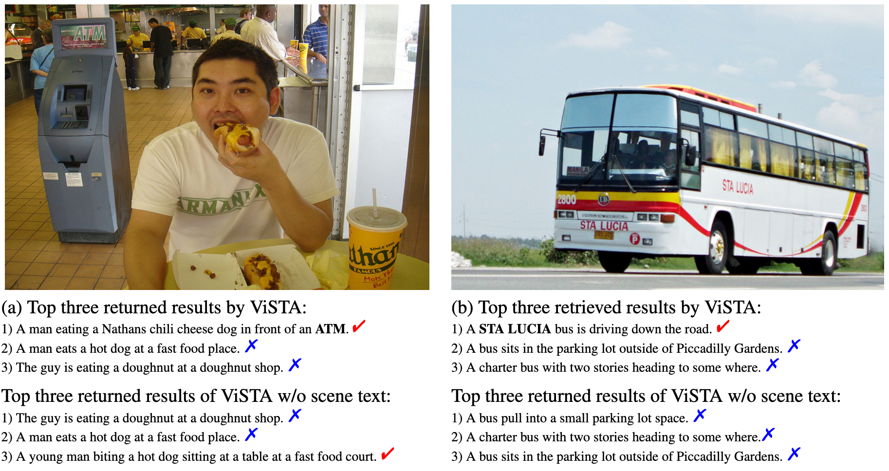
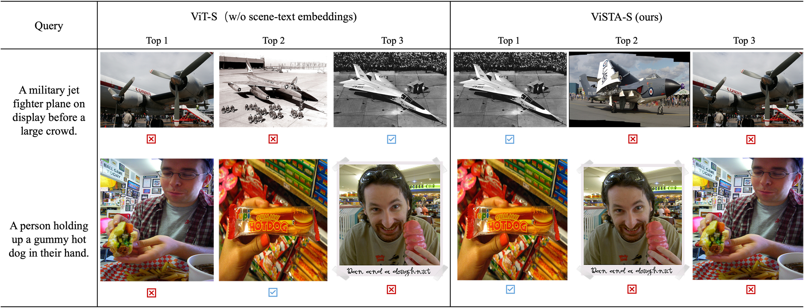

简体中文 | [English](README.md)
## _ViSTA_: Vision and Scene Text Aggregation for Cross-Modal Retrieval

- [结构](#结构)
- [预训练任务](#预训练任务)
- [跨模态检索](#跨模态检索)
  * [场景文本感知跨模态检索](#场景文本感知跨模态检索)
- [快速体验](#快速体验)
  * [安装PaddlePaddle](#安装PaddlePaddle)
  * [安装PaddleNlp](#安装PaddleNlp)
  * [下载推理模型](#下载推理模型)
  * [使用预训练模型推理](#使用预训练模型推理)
  * [检索结果可视化](#检索结果可视化)
- [引用](#引用)


## 结构
<div align="center">
    
</div>
<p align="center"> ViSTA模型结构 </p>

关于模型结构的基本设计概念, 请查阅论文:
>[_**ViSTA: Vision and Scene Text Aggregation for Cross-Modal Retrieval**_](https://arxiv.org/abs/2203.16778)
>
>Mengjun Cheng\*, Yipeng Sun\*<sup>\+</sup>, Longchao Wang, Xiongwei Zhu, Kun Yao, Jie Chen, Guoli Song, Junyu Han, Jingtuo Liu, Errui Ding, Jingdong Wang (\*: equal contribution, <sup>\+</sup>: corresponding author)
>
论文已被CVPR 2022会议接受
>

ViSTA是一个高效融合视觉特征与场景文本特征同时兼容场景文本缺失场景的全transformer图文跨模态检索模型。在图文跨模态检索场景中，视觉表征对理解图像起到最重要的作用，图像中包含的场景文本信息有时对于理解视觉语义信息有重要意义。在现有图文跨模态检索模型中，往往会忽视图像数据中包含的场景文本信息，若考虑加入场景文本信息辅助提升跨模态检索效果，场景文本缺失情况下可能会出现效果退化的问题。为了有效处理场景文本中模态缺失问题，ViSTA提出了一种基于fusion token的transformer融合方案,通过fusion token进行视觉与场景文本特征的相关信息交互。为进一步提升视觉语义表征能力，我们设计了一种双对比学习方案，将图像-文本对与融合-文本对嵌入到同跨模态空间中进行学习来提升视觉语义特征。我们所提出的跨模态检索模型在包含场景文本信息场景下显著优于现有模型，同时，在场景文本缺失场景下也能达到由于sota模型的效果。

## 预训练任务
- **ViSTA双塔图文预训练模型:** 我们基于[Visual Genome (VG)](https://visualgenome.org/api/v0/api_home.html)训练ViSTA双塔图文预训练模型。

## 跨模态检索
我们以VIT-S(vit_small)作为视觉编码器，BERT-mini作为场景文本与caption编码器，基于Flickr30K、TextCaption(TC)和COCO-Text Captioned(CTC)训练数据集上微调ViSTA双塔图文预训练模型，以COCO-Text Captioned(CTC)数据集作为跨模态检索任务评测集。
### 场景文本感知跨模态检索
   * 数据集
     * [Flickr30K](https://www.kaggle.com/hsankesara/flickr-image-dataset):包含31000张来自Flick的图像，每张图像基于人工标注提供5个场景描述的文本的数据集。
     * [TextCaps](https://textvqa.org/textcaps/dataset/):包含28000张图像与145000个图像文本描述数据集。
     * [COCO-Text Captioned](https://europe.naverlabs.com/research/computer-vision/stacmr-scene-text-aware-cross-modal-retrieval/):CTC训练数据集包含5683张图像和28415个图像文本描述，CTC-1K和CTC-5K用于图搜文和文搜图任务评测。
   * 效果:
     * ViSTA模型在CTC-1K数据集和CTC-5K数据集上图搜文与文搜图评测效果如下。
 
        | 模型                                        | CTC-1K<br>图搜文<br>R@1/R@5/R@10            | CTC-1K<br>文搜图<br>R@1/R@5/R@10           | CTC-5K<br>图搜文<br>R@1/R@5/R@10            | CTC-5K<br>文搜图<br>R@1/R@5/R@10           |           
        | :------------------------------------------ | :-----------------------------------------: | :-----------------------------------------: | :-----------------------------------------: | :-----------------------------------------: |
        | [SCAN](https://arxiv.org/abs/1803.08024)    | 36.3/63.7/75.2                              | 26.6/53.6/65.3                              | 22.8/45.6/54.3                              | 12.3/28.6/39.9                              |
        | [VSRN](https://arxiv.org/abs/1909.02701)    | 38.2/67.4/79.1                              | 26.6/54.2/66.2                              | 23.7/47.6/59.1                              | 14.9/34.7/45.5                              |
        | [STARNet](https://arxiv.org/abs/2012.04329) | 44.1/74.8/82.7                              | 31.5/60.8/72.4                              | 26.4/51.1/63.9                              | 17.1/37.4/48.3                              |
        | [ViSTA-S](https://arxiv.org/abs/2203.16778)    | **52.6/77.9/87.2**                          | **36.7/66.2/77.8**                          | **31.8/56.6/67.8**                          | **20.0/42.9/54.4**                          |
 

## 快速体验

### 安装PaddlePaddle
本代码库基于`PaddlePaddle develop`版, 可参考[paddlepaddle-quick](https://www.paddlepaddle.org.cn/install/quick)进行环境配置，或者使用pip进行安装，根据CUDA版本不同，可自行选择对应适配版本的PaddlePaddle代码库:

```bash
# We only support the evaluation on GPU by using PaddlePaddle, the installation command follows:
python -m pip install paddlepaddle-gpu==0.0.0.post102 -f https://www.paddlepaddle.org.cn/whl/linux/gpu/develop.html
```
### 安装PaddleNlp
PaddleNlp代码可参考(https://github.com/PaddlePaddle/PaddleNLP) 或者使用pip进行安装:

```bash
pip install paddlenlp
```

* 环境要求
```bash
python 3.6+
numpy
Pillow
paddlenlp>=2.2.3
cuda>=10.1
cudnn>=7.6.4
gcc>=8.2
```

* 安装要求
ViSTA的依赖库已在`requirements.txt`中列出，你可以使用以下命令行进行依赖库安装：
```
pip3 install --upgrade -r requirements.txt -i https://mirror.baidu.com/pypi/simple
```

### 下载推理模型
| 下载链接                                              | 参数量(M) |
| :------------------------------------------------- | :-----------|
| <a href="https://aistudio.baidu.com/aistudio/datasetdetail/147516" target="_blank">ViSTA-S for COCO-CTC image-text retrieval   </a>| 196 |


### 使用预训练模型推理

### CTC-1K和CTC-5K评测流程
1. 下载并解压[COCO-CTC](https://aistudio.baidu.com/aistudio/datasetdetail/147436/0)数据集到当前根目录下<./data>
2. 下载模型：[configs](https://aistudio.baidu.com/aistudio/datasetdetail/147517)、vista.pdparams
3. 运行shell脚本进行端到端评测

CTC_1K：```sh eval_scripts/run_eval_ctc_1k_online_scene_text_2D_ocr.sh vista.pdparams```

CTC_5K：```sh eval_scripts/run_eval_ctc_5k_online_scene_text_2D_ocr.sh vista.pdparams```


### 检索结果可视化
以下可视化结果为COCO-CTC数据集上图搜文与文搜图的可视化结果(与未引入场景文本信息的图文跨模态检索模型结果对比)

- 图搜文结果

<div align="center">
    
</div>

- 文搜图结果

<div align="center">
    
</div>


## 引用
相关文献请引用：

```
@article{cheng2022vista,
  title={ViSTA: Vision and Scene Text Aggregation for Cross-Modal Retrieval},
  author={Cheng, Mengjun and Sun, Yipeng and Wang, Longchao and Zhu, Xiongwei and Yao, Kun and Chen, Jie and Song, Guoli and Han, Junyu and Liu, Jingtuo and Ding, Errui and others},
  journal={arXiv preprint arXiv:2203.16778},
  year={2022}
}
```
