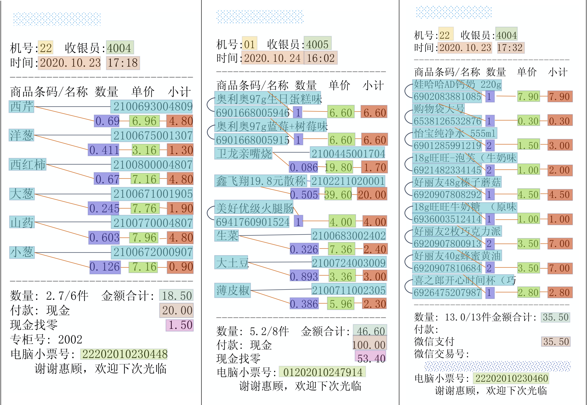

简体中文 | [English](README.md)

## _StrucTexT_: Structured Text Understanding with Multi-Modal Transformers

- [结构](#结构)
- [预训练任务](#预训练任务)
- [结构化文本理解](#结构化文本理解)
  * [字符级别实体分类](#字符级别实体分类)
  * [字段级别实体分类](#字段级别实体分类)
  * [字段级别实体连接](#字段级别实体连接)
- [快速体验](#快速体验)
  * [安装PaddlePaddle](#安装paddlepaddle)
  * [下载推理模型](#下载推理模型)
  * [使用预训练模型推理](#使用预训练模型推理)
  * [产品应用](#产品应用)
- [引用](#引用)


## 结构

<p align="center"> StrucTexT模型结构 </p>

关于模型结构的基本设计概念, 请查阅文章:
>[_**StrucTexT: Structured Text Understanding with Multi-Modal Transformers**_](https://arxiv.org/abs/2108.02923)
>
>Yulin Li\*, Yuxi Qian\*, Yuechen Yu\*, Xiameng Qin, Chengquan Zhang<sup>\+</sup>, Yan Liu, Kun Yao, Junyu Han, Jingtuo Liu and Errui Ding (\*: equal contribution, <sup>\+</sup>: corresponding author)
>
>论文已被ACM Multimedia 2021会议接受
>

StrucTexT是一个联合字符级别和字段级别文本多模态特征增强的预训练模型，主要用于文档、票据、卡证等富视觉图像中的OCR结构化信息提取任务。富视觉OCR图像中的文本内容和版式布局往往复杂多变，OCR结构化信息提取是一个极具挑战性的任务。大部分方法将OCR结构化任务解耦成两个大的任务类型：实体分类和实体连接，这两个任务都需要在字符级别和字段级别上对文本图像上下文信息进行准确的理解。StrucTexT也是一个字符级和字段级表达灵活输出的框架，能够根据下游任务的特性，选择合理的建模粒度去支持上述的结构化任务。除此之外，我们设计了一些新的、有针对性的自监督方式的预训练任务，来让StrucTexT拥有更丰富有效的特征表达。

基于国内场景中的商业文档图像，相对于论文版本，本次的模型作出了如下的一些修改:
- 模型在5000万数量的中英文混合图像数据集上进行预训练，这也是目前社区中数量最大的中英文混合图像数据集。
- 我们添加了遮罩式字段预测预训练任务，以增强模型字段级别的语义理解能力。
- 基于[ERNIE](https://github.com/PaddlePaddle/ERNIE)提供的字典，我们将字典扩展成了一个更大的中英文混合字典，来更好地支持中文和英文文档的理解。
- 引入了一种参数量更大的StrucTexT模型，并对其效果进行了公平的比较。

## 预训练任务
- **遮罩式视觉语言模型:** 我们随机选择一些记号(tokens)，然后遮掩掉并且要求模型恢复这些记号，来让模型学习到上下文信息。
- **字段长度预测:** 我们让模型预测每一个字段的长度，来让模型对齐视觉信息以及语义信息。
- **字段方位预测:** 我们让模型预测随机配对的字段之间相对的方向，来让模型获取到字段之间的的几何拓扑结构。

*最新更新*
- **遮罩式字段预测:** 除了遮罩式视觉语言模型，我们拓展预训练任务到字段级别，随机选择一些字段，然后遮掩掉该字段所有的记号（tokens），并且要求模型恢复这些记号，来让模型学习更复杂的语义信息。

## 结构化文本理解
我们在三个文档结构化理解任务上微调了StrucTexT，分别是字符级别实体分类(**T-ELB**)、字段级别实体分类(**S-ELB**)、字段级别实体连接(**S-ELK**)。

注意：后文中的实体分类任务的效果指标均为**字段级别 F1 score**，该指标计算相关字段类型的Macro F1 score。
### 字符级别实体分类
   * 数据集
      * [EPHOIE](https://github.com/HCIILAB/EPHOIE)主要来源于扫描版中文试卷文档。
      * 该数据集包括10种字段类型，每种字段均为字符级别的标注，也就是说一段文本行中不同的单字符可能属于不同的字段类型
      * 字符级别实体分类包含的类型如下： ``` 学科、测试时间、姓名、学校、考试号、座位号、班级、学号、年级、分数。```
   * 效果：不同设置下的StrucTexT模型在EPHOIE数据集的效果如下：

		| 模型                          | **字段级别 F1 score**          |
		| :---------------------------- | :----------------------------: |
		| StrucTexT-_eng base (paper)_  |            0.9795              |
		| StrucTexT-_chn&eng base_      |            0.9884              |
		| StrucTexT-_chn&eng large_     |            0.9930              |


### 字段级别实体分类
   * 数据集
      * [SROIE](https://rrc.cvc.uab.es/?ch=13&com=introduction)是一个用于票据信息抽取的公开数据集，由ICDAR 2019 Chanllenge提供。它包含了626张训练票据数据以及347张测试票据数据，每张票据都包含以下四个预定义字段：`公司名, 日期, 地址, 总价`。
      * [FUNSD](https://guillaumejaume.github.io/FUNSD/)是一个用于表单理解的数据集，它包含199张真实的、完全标注的扫描版图片，类型包括市场报告、广告以及学术报告等，并分为149张训练集以及50张测试集。FUNSD数据集适用于多种类型的任务，我们专注于解决其中的字段级别实体分类以及字段级别实体连接任务。
      * [XFUND](https://github.com/doc-analysis/XFUND)是一个多语种表单理解数据集，它包含7种不同语种表单数据，并且全部用人工进行了键-值对形式的标注。其中每个语种的数据都包含了199张表单数据，并分为149张训练集以及50张测试集，我们测试了XFUND的中文子数据集。
      * 所有以上的数据集我们都使用了官方提供的数据标注，并用于测试模型在信息抽取任务上的效果。
   * 效果: 不同设置下的StrucTexT模型在SROIE、FUNSD以及XFUND数据集的效果如下：

		| 模型                          | **SROIE**                      | **FUNSD**                      | **XFUND-ZH**                   |
		| :-----------------------------| :----------------------------: | :----------------------------: | :----------------------------: |
		| StrucTexT-_eng base (paper)_  |           0.9688               |           0.8309               |             -                  |
		| StrucTexT-_chn&eng base_      |           0.9827               |           0.8483               |           0.9101               |
		| StrucTexT-_chn&eng large_     |           0.9870               |           0.8756               |           0.9229               |


### 字段级别实体连接
   实体连接任务主要用于预测语义实体之间的连接关系。
   * 数据集
      * [FUNSD](https://guillaumejaume.github.io/FUNSD)标注的连接格式为`(entity_from, entity_to)`，代表着该连接为一对“问题-答案”，模型主要任务为预测语义实体之间的连接关系。
      * [XFUND](https://github.com/doc-analysis/XFUND)的实验设置与FUNSD相同，我们在其中的中文子数据集测试了模型的效果。
   * 效果: 不同设置下的StrucTexT模型在FUNSD以及XFUND-ZH数据集的效果如下（在所有可能的语义实体连接对中预测的**F1 score**）：

		| 模型                          | **FUNSD**                      | **XFUND-ZH**                   |
		| :---------------------------- | :----------------------------: | :----------------------------: |
		| StrucTexT-_eng base (paper)_  |           0.4410               |             -                  |
		| StrucTexT-_chn&eng base_      |           0.7045               |           0.8009               |
		| StrucTexT-_chn&eng large_     |           0.7421               |           0.8681               |


## 快速体验

### 安装PaddlePaddle
本代码库基于`PaddlePaddle 2.1.0+`，你可参阅[paddlepaddle-quick](https://www.paddlepaddle.org.cn/install/quick)进行环境准备，或者使用pip进行安装：

```bash
# We only support the evaluation on GPU by using PaddlePaddle, the installation command follows:
pip3 install paddlepaddle-gpu --upgrade -i https://mirror.baidu.com/pypi/simple
```

* 环境要求

```bash
python 3.6+
opencv-python 4.2.0+
tqdm
tabulate
cuda >= 10.1
cudnn >= 7.6.4
gcc >= 8.2
```

* 安装要求

StrucTexT的依赖库已在`requirements.txt`中列出，你可以使用以下命令行进行依赖库安装：

```
pip3 install --upgrade -r requirements.txt -i https://mirror.baidu.com/pypi/simple
```

### 下载推理模型

| 下载链接                                              | 参数量(M) |
| :------------------------------------------------- | :-----------|
| <a href="https://aisee.bj.bcebos.com/VIMER/StrucTexT/StrucTexT_base_ephoie_labeling.pdparams.tar.gz?authorization=bce-auth-v1%2Fdb0b41e2ab894ecfb1126a768c603d79%2F2021-12-02T08%3A49%3A14Z%2F-1%2Fhost%2F6f75cab944e45627d5f1f630377f4b016dd94104322136bc060912273b852d52" target="_blank">StrucTexT Base for EPHOIE labeling</a>   | 181 |
| <a href="https://aisee.bj.bcebos.com/VIMER/StrucTexT/StrucTexT_large_ephoie_labeling.pdparams.tar.gz?authorization=bce-auth-v1%2Fdb0b41e2ab894ecfb1126a768c603d79%2F2021-12-02T08%3A50%3A36Z%2F-1%2Fhost%2Fa4b284ef849b5ada868403cc8626d1d89d4ca3b5b89b40fc3e0b8e7ffc251753" target="_blank">StrucTexT Large for EPHOIE labeling</a> | 458 |
| <a href="https://aisee.bj.bcebos.com/VIMER/StrucTexT/StrucTexT_base_funsd_labeling.pdparams.tar.gz?authorization=bce-auth-v1%2Fdb0b41e2ab894ecfb1126a768c603d79%2F2021-12-02T08%3A49%3A49Z%2F-1%2Fhost%2Fc3b3648f106aaaf1c73c7876c2012fa55c74016325f0352892323165c5b3a16c" target="_blank">StrucTexT Base for FUNSD labeling</a>     | 181 |
| <a href="https://aisee.bj.bcebos.com/VIMER/StrucTexT/StrucTexT_base_funsd_linking.pdparams.tar.gz?authorization=bce-auth-v1%2Fdb0b41e2ab894ecfb1126a768c603d79%2F2021-12-02T08%3A50%3A16Z%2F-1%2Fhost%2F50aee9546d618b296ec1dfc54084e497ee4836f7034dbe6e2131c26a4003f870" target="_blank">StrucTexT Base for FUNSD linking</a>       | 181 |


### 使用预训练模型推理
   * EPHOIE数据集字符级别实体分类任务

```python
# 1. 下载并解压EPHOIE数据集到目录<ephoie_folder>.
# 2. 下载模型：StrucTexT_ephoie_(base/large)_labeling.pdparams
# 3. 运行下述脚本生成评测数据文件.
python data/make_ephoie_data.py \
    --config_file ./configs/(base/large)/labeling_ephoie.json \
    --label_file examples/ephoie/test_list.txt \
    --label_dir <ephoie_folder>/final_release_image_20201222/ \
    --kvpair_dir <ephoie_folder>/final_release_kvpair_20201222/ \
    --out_dir <ephoie_folder>/test_labels/

# 4. 运行下述脚本启动EPHOIE数据集labeling任务评测.
python ./tools/eval_infer.py \
    --config_file ./configs/(base/large)/labeling_ephoie.json \
    --task_type labeling_token \
    --label_path <ephoie_folder>/test_labels/ \
    --image_path <ephoie_folder>/final_release_image_20201222/ \
    --weights_path StrucTexT_ephoie_(base/large)_labeling.pdparams
```
   * FUNSD数据集字段级别实体分类任务

```python
# 1. 下载并解压FUNSD数据集到目录<funsd_folder>.
# 2. 下载模型：StrucTexT_funsd_base_labeling.pdparams
# 3. 运行下述脚本生成评测数据文件.
python data/make_funsd_data.py \
    --config_file ./configs/base/labeling_funsd.json \
    --label_dir <funsd_folder>/dataset/testing_data/annotations/ \
    --out_dir <funsd_folder>/dataset/testing_data/test_labels/

# 4. 运行下述脚本启动FUNSD数据集labeling任务评测.
python ./tools/eval_infer.py \
    --config_file ./configs/base/labeling_funsd.json \
    --task_type labeling_segment \
    --label_path <funsd_folder>/dataset/testing_data/test_labels/ \
    --image_path <funsd_folder>/dataset/testing_data/images/ \
    --weights_path StrucTexT_funsd_base_labeling.pdparams
```
   * FUNSD数据集字段级别实体连接任务

```python
# 1. 下载并解压FUNSD数据集到目录<funsd_folder>.
# 2. 下载评测模型：StrucTexT_funsd_base_linking.pdparams
# 3. 运行下述脚本生成评测数据文件.
python data/make_funsd_data.py \
    --config_file ./configs/base/linking_funsd.json \
    --label_dir <funsd_folder>/dataset/testing_data/annotations/ \
    --out_dir <funsd_folder>/dataset/testing_data/test_labels/

# 4. 运行下述脚本启动FUNSD数据集linking任务评测.
python ./tools/eval_infer.py \
    --config_file ./configs/base/linking_funsd.json \
    --task_type linking \
    --label_path <funsd_folder>/dataset/testing_data/test_labels/ \
    --image_path <funsd_folder>/dataset/testing_data/images/ \
    --weights_path StrucTexT_funsd_base_linking.pdparams
```

### 产品应用
以下可视化数据来源于StrucTexT的实际应用效果。*不同颜色代表不同的实体类别，实体之间的黑色连接线代表它们属于同一实体，橙色连接线代表实体之间存在连接关系。*

- 购物小票
<div align="center">
    
</div>
- 船票/车票
<div align="center">
    
</div>
- 机打发票
<div align="center">
    
</div>

更多相关信息与应用，请参考[Baidu OCR](https://ai.baidu.com/tech/ocr)开放平台。

## 引用
相关文献请引用:
```
@inproceedings{li2021structext,
  title={StrucTexT: Structured Text Understanding with Multi-Modal Transformers},
  author={Li, Yulin and Qian, Yuxi and Yu, Yuechen and Qin, Xiameng and Zhang, Chengquan and Liu, Yan and Yao, Kun and Han, Junyu and Liu, Jingtuo and Ding, Errui},
  booktitle={Proceedings of the 29th ACM International Conference on Multimedia},
  pages={1912--1920},
  year={2021}
}
```
